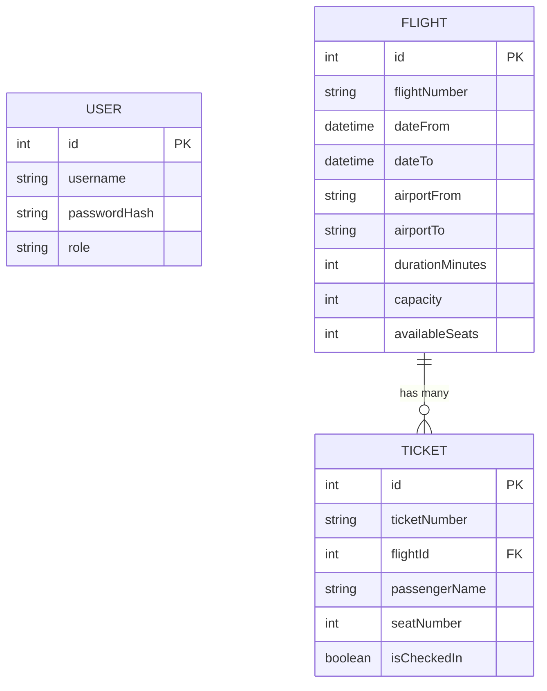
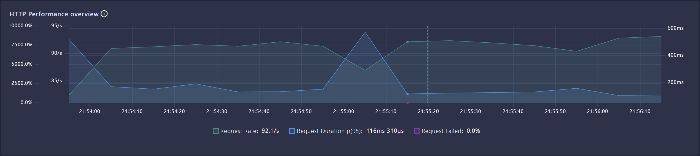
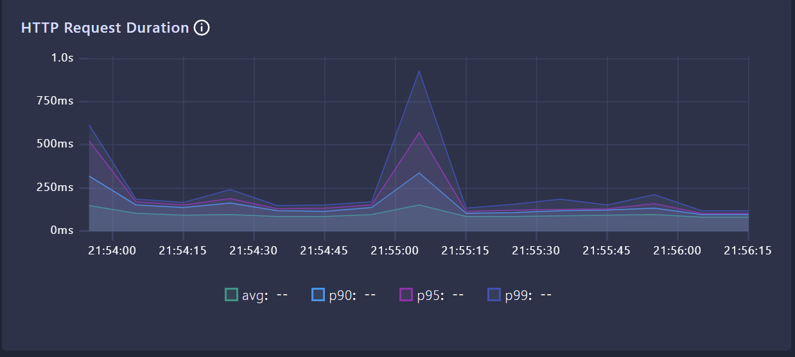
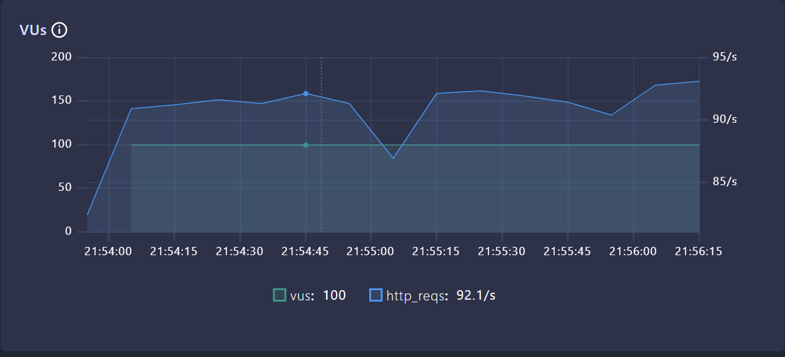
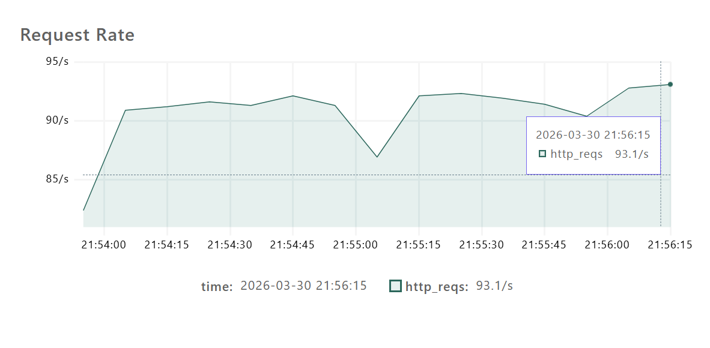

# SE4458 Midterm - Airline Ticketing System API

This project is an Airline Ticketing System API developed for the SE4458 course midterm assignment.

Drive Video Link: [https://drive.google.com/drive/folders/1A10LJTEiwWwqEu_Wcd4Adcx_lxysc9IL?usp=sharing](https://drive.google.com/drive/folders/1A10LJTEiwWwqEu_Wcd4Adcx_lxysc9IL?usp=sharing)

## Assumptions
- For a more realistic check-in experience, only the passenger's last name and ticket number were used for validation instead of the full passenger name.
- I left the `oneWay` and `roundTrip` configurations (mentioned in the assignment) ineffective during the Flight Query, because this option was incompatible with the rest of the assignment's data structure (where all flights are essentially single, one-way instances).

### Performance Metrics & Analysis

| Scenario | Max VUs | Duration | Avg Response | 95th Percentile (p95) | Req/sec (Throughput) | Error Rate |
| :--- | :--- | :--- | :--- | :--- | :--- | :--- |
| **Normal Load** | 20 | 30s | 84.74ms | 157.27ms | 18.02 req/s | 0.00% |
| **Peak Load** | 50 | 30s | 93.90ms | 155.17ms | 44.11 req/s | 0.00% |
| **Stress Load** | 100 | 30s | 112.49ms| 272.02ms | 85.60 req/s | 0.00% |

### Endpoints Tested
The load test targets the two most critical business flows in the Airline Ticketing System:
- **`GET /api/v1/flights`**: Simulates users querying available flights. This is a high-read operation that evaluates the efficiency of the flight retrieval and rate-limiting logic.
- **`POST /api/v1/tickets/buy`**: Simulates authenticated users purchasing a ticket. This is a complex write operation evaluated for concurrency handling, involving database locks, capacity validation, and transactional integrity.

**Performance Under Load:** The API performed very well under all tested scenarios. Even under the Stress Load of 100 concurrent Virtual Users hitting the read and write endpoints simultaneously, the system maintained an error rate of 0.00% across thousands of iterative checks. The `p95` response time stayed comfortably under the 1500ms SLA, peaking at just 272ms, while the throughput scaled perfectly linearly to 85.60 requests per second.

**Observed Bottlenecks:** The slight increase in average response time (from ~84ms to ~112ms) during the Stress test indicates small database lock contention and CPU bottlenecks. Specifically, the `availableSeats` decrementing logic on the database acts as a transactional bottleneck when many VUs try to reserve tickets on the same flight at the same time.

**Potential Scalability Improvements:** To improve scalability and support thousands of VUs, we could implement a caching layer like Redis for the `GET /api/v1/flights` endpoint to entirely offload read traffic from PostgreSQL. Additionally, using the ticket purchase process with an asynchronous event queue such as RabbitMQ or Kafka would prevent database locking and ensure the API remains stable during high traffic.

## Design and Architecture

The system was developed in accordance with **Service-Oriented Architecture (SOA)** principles:
- **Controller Layer:** Handles incoming HTTP requests, performs validation, and delegates processing to services.
- **Service Layer:** Encapsulates all Business Logic.
- **Repository Layer:** Abstracts database interactions (using Prisma and Supabase).
- **Middleware Layer:** Manages cross-cutting concerns such as Authentication (JWT), Authorization (RBAC), and Rate Limiting.

## Data Model (ER Diagram)



## Load Testing (k6)

You can run the test script located at [`airline-api/tests/load/airline-load-test.js`](./airline-api/tests/load/airline-load-test.js) to observe the performance results:
```bash
k6 run tests/load/airline-load-test.js
```

### Screenshots/Graphs of Load Test Results






## Installation and Setup

1. Install required packages: `npm install`
2. Create an `.env` file and update the `DATABASE_URL` variable with your database connection string.
3. Apply Prisma database migrations: `npx prisma migrate dev`
4. Start the application: `npm run dev`

## Additional Details

- **JWT Auth:** `POST /api/v1/auth/register` and `POST /api/v1/auth/login`.
- **Swagger:** API documentation is accessible via the `/api-docs` endpoint.
