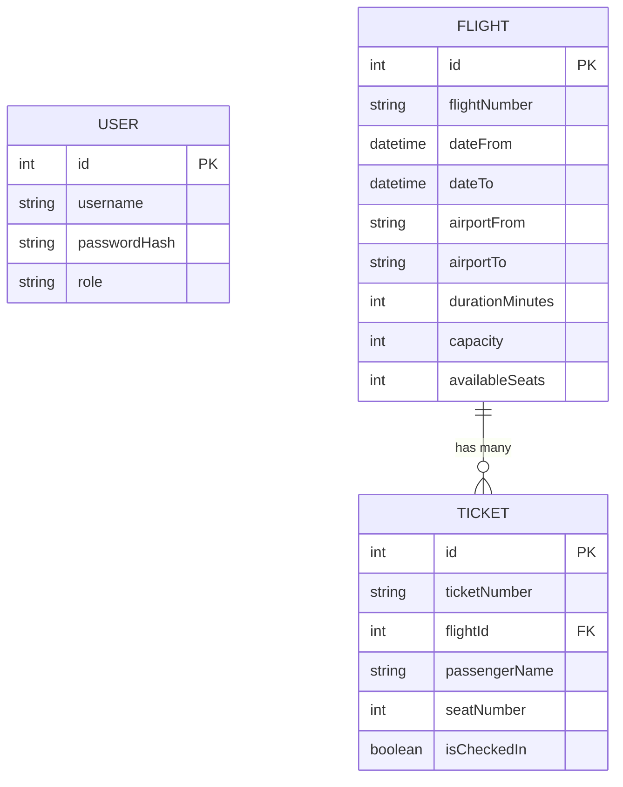

# SE4458 Midterm – Airline Ticketing System API

Bu proje, SE4458 dersi midterm ödevi kapsamında geliştirilmiş bir Havayolu Biletleme Sistemi API'sidir.

## Tasarım ve Mimari

Sistem, **Servis Odaklı Mimari (Service-Oriented Architecture)** prensiplerine uygun olarak geliştirilmiştir:
- **Controller Katmanı:** İstekleri karşılar, validasyon yapar ve servisleri çağırır.
- **Service Katmanı:** Tüm iş mantığını (Business Logic) barındırır.
- **Repository Katmanı:** Veritabanı işlemlerini (Prisma üzerinden) soyutlar.
- **Middleware Katmanı:** Kimlik doğrulama (JWT), Yetkilendirme (RBAC) ve Hız Sınırlama (Rate Limiting) gibi çapraz işlevleri yönetir.

## Veri Modeli (ER Diyagramı)



## Varsayımlar (Assumptions)

1. **Koltuk Atama:** Koltuklar 1'den başlayarak uçuş kapasitesine kadar sırayla atanır.
2. **Bilet Numarası:** `TKT-{YYYYMMDD}-{RANDOM}` formatında üretilir.
3. **Check-in:** Sadece geçerli bileti olan ve daha önce check-in yapmamış yolcular işlem yapabilir.
4. **Rate Limiting:** Ödevde belirtildiği üzere `Query Flight` ucu için günde 3 çağrı sınırı IP bazlı uygulanmıştır.
5. **CSV Yükleme:** Admin rolündeki bir kullanıcı tarafından toplu uçuş yüklemesi yapılabilir.

## Kurulum ve Çalıştırma

1. Bağımlılıkları yükleyin: `npm install`
2. `.env` dosyasındaki `DATABASE_URL` bilgisini güncelleyin.
3. Prisma migration'ları uygulayın: `npx prisma migrate dev`
4. Uygulamayı başlatın: `npm run dev`

## Yük Testi (k6)

`tests/load/query-flight.k6.js` dosyasını çalıştırarak sonuçları görebilirsiniz:
```bash
k6 run tests/load/query-flight.k6.js
```

## Diğer Detaylar

- **JWT Auth:** `POST /api/v1/auth/register` ve `POST /api/v1/auth/login`.
- **Swagger:** API dokümantasyonu `/api-docs` adresinden erişilebilir (setup aşamasında).
